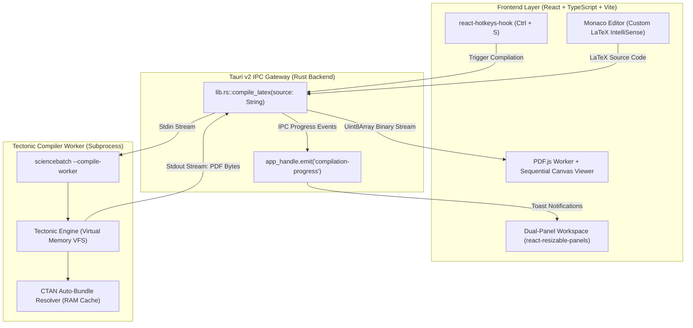

<div align="center">

# ⚡ ScienceBatch
### High-Performance, Offline Desktop LaTeX & Typst Editor

[](https://tauri.app/)
[](https://www.rust-lang.org/)
[](https://react.dev/)
[](https://www.typescriptlang.org/)
[](LICENSE)

*An ultra-fast, 100% offline desktop alternative to cloud-based LaTeX editors. Features in-memory VFS compilation with Tectonic, Monaco Editor with contextual IntelliSense, and GPU-accelerated PDF rendering.*

[Key Features](#-key-features) • [Architecture](#-system-architecture) • [Getting Started](#-getting-started) • [Tech Stack](#-tech-stack) • [License](#-license)

---

</div>

## 🚀 Key Features

- 🏎️ **In-Memory RAM Compilation (Zero Disk Pollution):** Zero intermediate auxiliary files (`.aux`, `.log`, `.toc`, `.out`) written to your local disk. Powered by an isolated [Tectonic](https://tectonic-typesetting.github.io/) engine and native [Typst](https://typst.app/) compiler in RAM that pipes PDF binary data directly to the frontend.
- 🌐 **Polyglot Studio (LaTeX & Typst):** Seamlessly switch between LaTeX (Tectonic/XeTeX) and Typst compilation engines with per-engine syntax highlighting, math numbering, and live diagnostics.
- 📁 **Full Workspace & Multi-File Project Support:** Open any local paper repository or folder. Resolves relative assets (`figures_pdf/`, `figures/`, `images/`), external `.cls`/`.sty` document classes, and nested file trees.
- 📚 **Full Overleaf & BibTeX Compatibility:** Automatic detection and parsing of `.bib` files, dynamic citation keys suggestions (`\cite{`), and complete IEEE / ACM document class parity.
- 📦 **First-Class Academic Classes & Modern Icon Suites:**
  - Built-in support and offline zero-warning linting for leading paper classes: **IEEEtran**, **ACM (`acmart`)**, **Springer (`llncs`)**, and **CurVe CV** (`\makerubric`, `\photo`, `\entry*`).
  - Full icon library support: **FontAwesome 5** (1,600+ icons via universal `\fa[A-Z]...` namespace), embedded **SimpleIcons** (`\simpleicon`), and **Academicons** (`\orcidicon`, `\orcidlink`).
  - Dynamic workspace scanner that automatically parses custom `.cls` and `.sty` files on the fly, registering custom macros in memory without configuration.
- 🖼️ **Asset Viewer Modal (PDF & Images):** Direct preview of `.png`, `.jpg`, `.svg`, `.webp`, and `.pdf` graphics files straight from the file tree sidebar.
- 🛡️ **Zero-Crash Isolated Worker Architecture:** Compilations are executed in an isolated child subprocess (`sciencebatch --compile-worker`). TeX syntax errors or C-level panics never crash or freeze the desktop GUI.
- ⚡ **Asynchronous On-Demand Execution:** Compiles exclusively when requested via global `Ctrl + S` (or `Cmd + S`) or the toolbar button. No wasteful CPU-draining debounces.
- 🧠 **Contextual IntelliSense (Monaco Editor):**
  - Instant auto-completion for 120+ LaTeX commands, math symbols, and environments.
  - Dynamic scanning of `\label{...}` anchors for `\ref{` suggestions.
  - Automatic scanning of BibTeX `@article{...}` keys for `\cite{` suggestions.
  - Hover documentation with syntax examples for TeX functions and environments.
- 📄 **PDF Preview:** PDF.js parses documents in a worker and renders pages sequentially to high-DPI canvases, preserving scroll position and zoom across compilations. The Tauri viewer uses the standard image-conversion path while a WebKitGTK zoom-rendering issue is under visual validation.
- 📖 **PDF Preview Engineering Notes:** See [PDF preview rendering](docs/PDF_PREVIEW.md) for the rendering lifecycle, current compatibility investigation, and verification steps.
- 🩺 **Actionable Diagnostics & Smart Suggestions:** Categorized error and warning cards with direct jump-to-line navigation and auto-generated fixes (e.g., float specifier advice, asset path resolution, package clash hints).
- 🪟 **Fluid Resizable Split View:** Responsive dual-panel workspace built with `react-resizable-panels`.
- 🔔 **Non-Intrusive Progress Toasts:** Dynamic real-time IPC notification toasts powered by `sonner`.

---

## 🏛️ System Architecture



---

## 🛠️ Tech Stack

| Layer | Technology | Description |
|---|---|---|
| **Native Runtime** | [Tauri v2](https://tauri.app/) | Secure, ultra-lightweight desktop shell with minimal memory footprint. |
| **TeX Engine** | [Tectonic](https://tectonic-typesetting.github.io/) | Modernized XeTeX engine with pure VFS in-memory processing and on-demand CTAN packaging. |
| **Frontend Core** | [React 18](https://react.dev/) + [TypeScript](https://www.typescriptlang.org/) + [Vite](https://vitejs.dev/) | High-performance modular component architecture and instant HMR. |
| **Code Editor** | [Monaco Editor](https://microsoft.github.io/monaco-editor/) | Desktop-class editor with syntax highlighting and custom LaTeX completion providers. |
| **PDF Rendering** | [PDF.js](https://mozilla.github.io/pdf.js/) | Worker-based PDF parsing and sequential high-DPI canvas rendering. |
| **Layout & UI** | [React Resizable Panels](https://github.com/bvaughn/react-resizable-panels) & [Sonner](https://sonner.emilkowal.ski/) | Responsive split workspace and toast notifications. |

---

## 📦 Getting Started

### Prerequisites

1. **Rust Toolchain:**
   ```bash
   curl --proto '=https' --tlsv1.2 -sSf https://sh.rustup.rs | sh
   ```
2. **Node.js (v18+) & pnpm:**
   ```bash
   npm install -g pnpm
   ```
3. **Linux System Dependencies (Ubuntu / Debian):**
   ```bash
   sudo apt update
   sudo apt install -y libwebkit2gtk-4.1-dev build-essential curl wget file libxdo-dev libssl-dev libayatana-appindicator3-dev librsvg2-dev libpng-dev libharfbuzz-dev libfontconfig1-dev
   ```

### Installation & Development

```bash
# 1. Clone repository
git clone https://github.com/your-username/sciencebatch.git
cd sciencebatch

# 2. Install frontend dependencies
pnpm install

# 3. Launch desktop app in development mode
pnpm tauri dev
```

### Production Build

```bash
# Build native standalone desktop executable
pnpm tauri build
```

---

## ⌨️ Shortcuts & Usage

| Shortcut | Action | Description |
|---|---|---|
| `Ctrl + S` / `Cmd + S` | **Compile Document** | Triggers in-memory Tectonic compilation and updates PDF canvas. |
| `\` | **Trigger IntelliSense** | Opens autocomplete dropdown for LaTeX commands and snippets. |
| `\ref{` | **Dynamic Label Reference** | Auto-scans document labels and suggests matching anchors. |
| `\cite{` | **Dynamic Citation Reference** | Auto-scans document BibTeX entries and suggests citation keys. |

---

## 📄 License

This project is licensed under the **Apache License 2.0** — see the [LICENSE](LICENSE) file for details.
